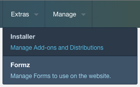
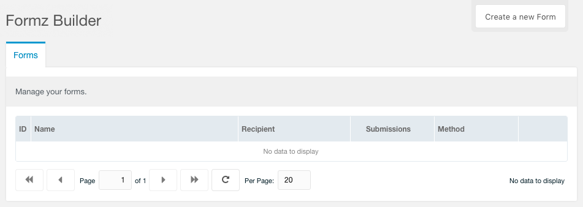
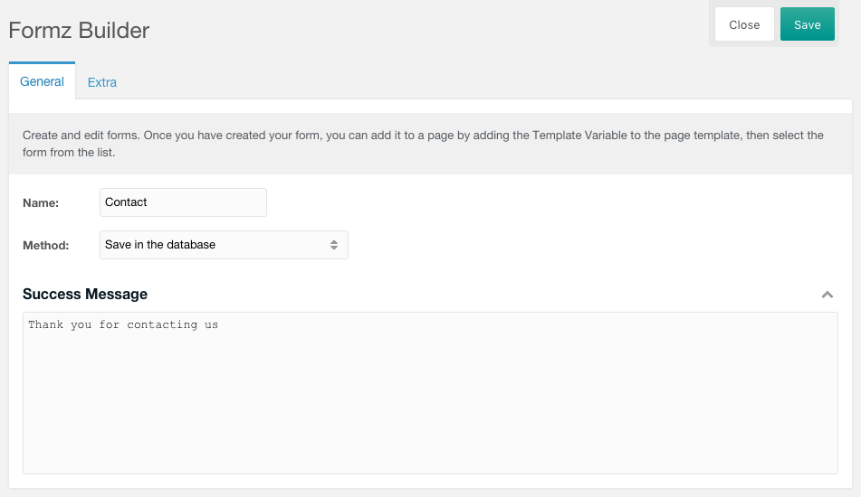
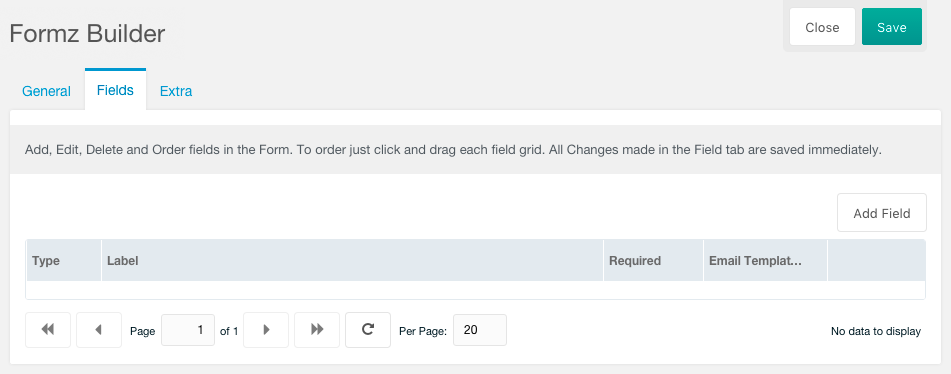
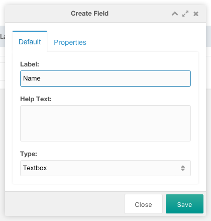
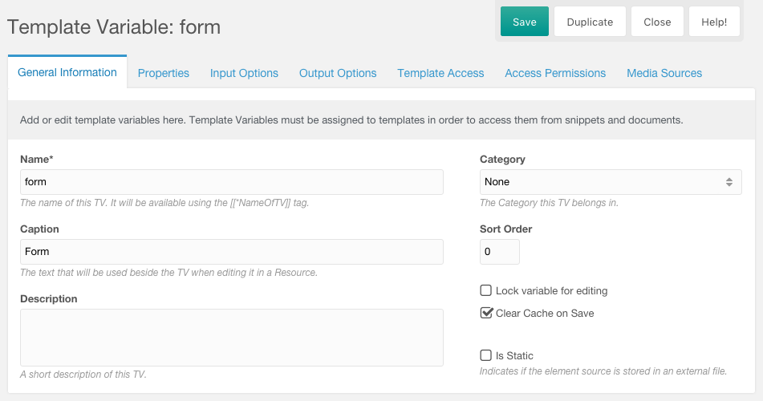
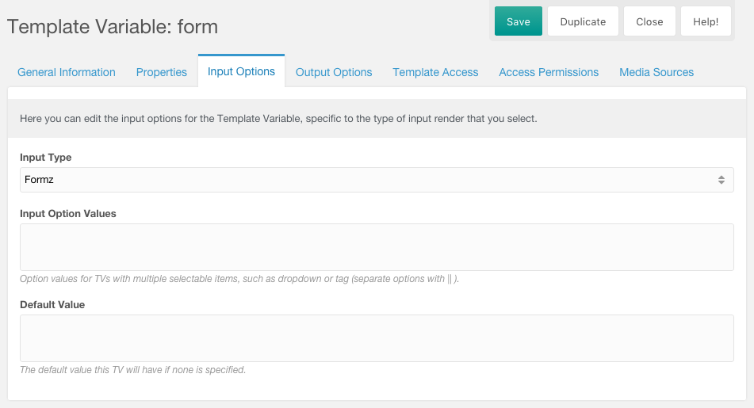
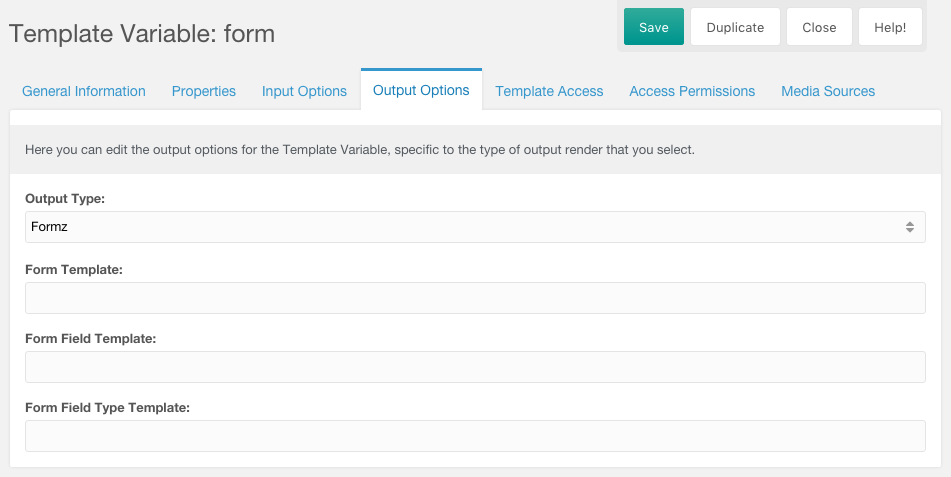
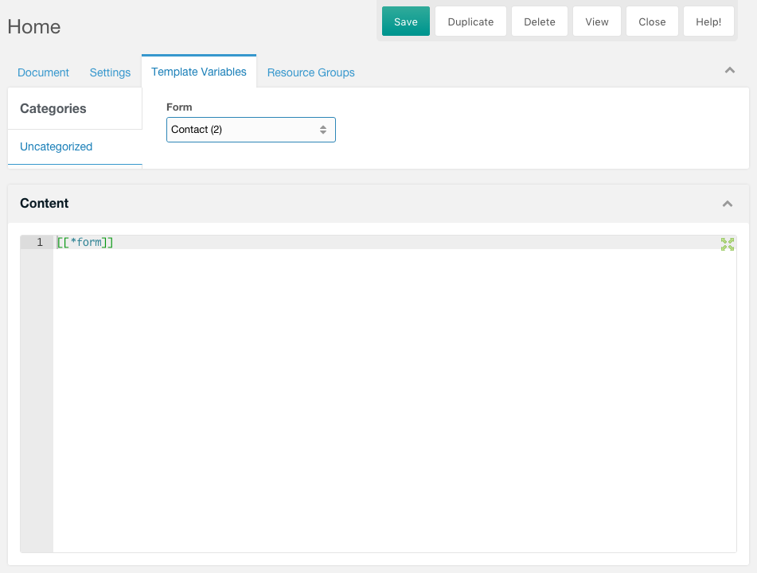

## Quickstart Guide
Here I will walk you through creating your first Formz form:

1. Go to the extras menu in MODX and select `Formz Builder`.
 **Figure 1** Component Menu

2. Click on `Create a new Form`, once the interface is ready we can start by entering the required fields. The `Name` field is required and so is the `Success Message`, all the other fields can remain default.
 **Figure 2** Create a new Form

3. Enter *"Contact"* in the `Name` field and *"Thank you for contacting us"* in the `Success Message` field.
 **Figure 3** Form Required Fields

4. Click on `Save` and the browser should reload and you will now be in edit mode.
5. Click on `Fields` tab and this is where you enter the fields you want available to your form.
 **Figure 5** Fields Tab

6. Above the Grid you will see `Add Field` action at the top right. Click on this button and a form window will open.
7. The `Label` field is the only required field on this form, we will enter *"Name"* for our Label.
 **Figure 7** Field Window
8. Now click on the `Properties` tab and check the `required` checkbox. This will make sure that the user has to enter a name in order to submit the web form.
 **Figure 8** Properties Tab
9. Repeat step 7 but this time lets enter in the `Label` field *"Email"* and on the `Properties` tab lets check the `required` checkbox and select from the `Validation` field *"Email"*.
 **Figure 9** Validation Field
10. Repeat step 7 but this time lets enter in the `Label` field *"Message"*, then change the `Type` field to *"Textarea"* and on the `Properties` tab check the `required` checkbox
 **Figure 10** Type Field
11. Lets create our Template Variable to display our Form on the website, lets enter in the `Name` field *"form"* and in the `Caption` field *"Form"*.
 **Figure 11** Template Variable
12. Click the `Input Options` tab and set the `Input Type` field to *"Formz"*.
 **Figure 12** Input Options
13. Click the `Output Options` tab and set the `Output Type` field to *"Formz"*.
 **Figure 13** Output Options
14. Click the `Template Access` tab and set which template you want to have access to your Template Variable.
 **Figure 14** Template Variable Tab
15. Place you newly created Template Variable `[[*form]]` inside your template or in the content area of the page you will create. I will do the latter for this guide.
 **Figure 15** Page Content
16. Click the `Template Variables` tab and select your *"Contact"* from the `Form` field.
 **Figure 16** Template Variables Tab

Congratulations you have created your first web form with Formz, now go and create more and explore the features.
